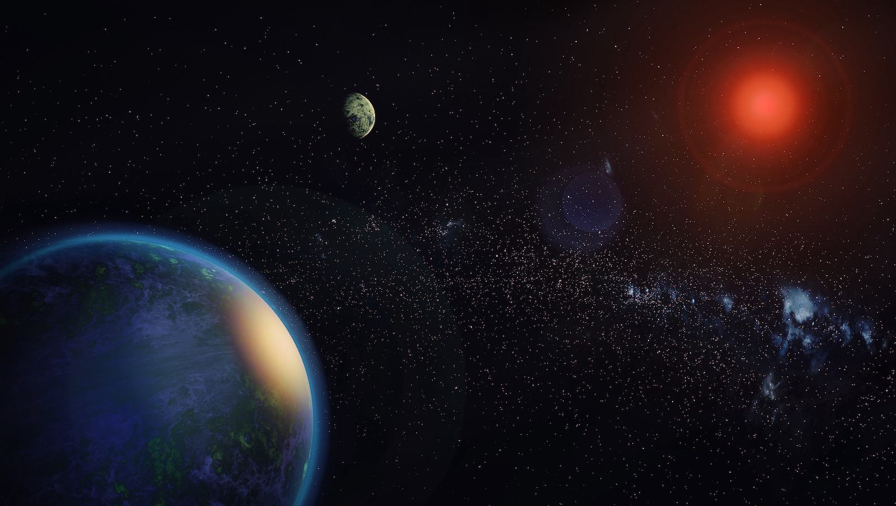

```{r setup, include=FALSE}
knitr::opts_chunk$set(echo = FALSE,  warning = FALSE, comment = FALSE, error = FALSE)

#PAQUETES UTILIZADOS
library(readr)
library(readxl)
library(dplyr)
library(tidyr)
library(ggplot2)
library(grid)
library(gridExtra)
library(spData)
library(sf)
library(kableExtra)
library(plotly)

#OPCIONES GENERALES
options(dplyr.summarise.inform = FALSE, scipen = 999)
```

```{r}
#IMPORTACIÓN DE BASES DE DATOS
datos <- read_csv("Datasets/dataNASA.csv", skip = 22,show_col_types = FALSE) #El argumento skip = 22 se agrega para que R comience a leer la base a partir de la fila #23 (salteándose las primeras 22). 
datos_geo <- read_xlsx("Datasets/locations.xlsx")
```

# Introducción

<div align="justify">
Los **exoplanetas o planetas extrasolares** son planetas que orbitan alrededor de otras estrellas que se encuentran más allá de nuestro sistema solar. En los últimos 20 años se han encontrado más de 5000 planetas extrasolares, los cuales incluyen mundos pequeños y rocosos como la Tierra, gigantes gaseosos muchas veces más grandes que Júpiter, planetas "superterrestres", que son mundos rocosos más grandes que el nuestro, y planetas "subneptunianos", que son versiones más pequeñas del planeta Neptuno de nuestro sistema solar. También se han encontrado planetas que orbitan alrededor de dos estrellas al mismo tiempo y planetas que describen sus órbitas alrededor de los restos colapsados de estrellas muertas.

```{r, fig.align = 'center'}

```

Partiendo del enorme interés y curiosidad personal en el tema como motivaciones principales, para la elaboración de este Trabajo Final se optó por la elaboración del presente documento producido en RMarkdown en el que se presenta un resumen descriptivo de las características más sobresalientes de los exoplanetas encontrados desde la década de los '90 a la actualidad, de los sistemas planetarios de los que forman parte, sitios de descubrimiento y métodos a través de los cuales fueron hallados.
</div>

# Materiales y métodos

## Bases de datos
<div align="justify">
La base de datos principal se descargó directamente en formato .csv de la web del [**Archivo de Exoplanetas de la NASA**](https://exoplanetarchive.ipac.caltech.edu/cgi-bin/TblView/nph-tblView?app=ExoTbls&config=PSCompPars). Este archivo registra los descubrimientos de exoplanetas que han sido reportados en publicaciones científicas revisadas por pares y confirmados utilizando varios métodos de detección y/o técnicas analíticas.

Para cada uno de los exoplanetas de existencia confirmada el Archivo de la NASA cuenta con información sobre el sistema planetario completo (el planeta en sí, su/s luna/s -si existen- y la estrella central del sistema). Estos datos incluyen parámetros estelares (como posiciones, magnitudes y temperaturas), información sobre los exoplanetas descubiertos (como masas y parámetros orbitales) y datos de descubrimiento/caracterización (como las instalaciones e instrumental utilizados, métodos de descubrimiento, curvas de velocidad radial publicadas, curvas de luz fotométrica, imágenes y espectros).

Por una cuestión de simplicidad en el análisis, se hizo uso de las herramientas dinámicas en la web citada para seleccionar únicamente algunas variables de interés, fundamentalmente aquellas que permiten caracterizar desde el punto de vista astronómico las características orbitales de los exoplanetas descubiertos y las relacionadas con los descubrimientos en sí (instalaciones y sitios desde los que se hicieron los hallazgos, años de descubrimiento, etc.).

A continuación se presentan las variables seleccionadas que componen la base de datos *dataNASA.csv*:
</div>

| Variable        | Tipo de registro [unidades]      | Descripción                                                                                                                                                                                                   |
|------------------|------------------|------------------------------------|
| pl_name         | Caracter                         | Nombre del planeta más comúnmente usado en la literatura.                                                                                                                                                     |
| host_name       | Caracter                         | Nombre de la estrella del sistema planetario más comúnmente usado en la literatura.                                                                                                                           |
| sy_snum         | Numérico                         | Número de estrellas en el sistema planetario.                                                                                                                                                                 |
| sy_pnum         | Numérico                         | Número de planetas en el sistema planetario.                                                                                                                                                                  |
| sy_mnum         | Numérico                         | Número de lunas en el sistema planetario.                                                                                                                                                                     |
| discoverymethod | Caracter                         | Método a través del cual el planeta fue identificado por primera vez (Radial Velocity/Transits/Microlensing/Imaging/Timing Variations/Orbital Brightness/Modulation/Astrometry/Disk Kinematics).              |
| disc_year       | Numérico                         | Año de descubrimiento del planeta.                                                                                                                                                                            |
| disc_locale     | Caracter                         | Ubicación del sitio de observación responsable del descubrimiento (Ground/Space/Multiple Locales).                                                                                                                             |
| disc_facility   | Caracter                         | Nombre de la instalación responsable del descubrimiento.                                                                                                                                                      |
| disc_telescope  | Caracter                         | Nombre del telescopio utilizado para hacer las observaciones.                                                                                                                                                 |
| disc_instrument | Caracter                         | Nombre del instrumento utilizado para las observaciones.                                                                                                                                                      |
| pl_orbper       | Numérico [días]                  | Periodo orbital del planeta: tiempo que le toma al planeta realizar una órbita completa alrededor de la estrella del sistema.                                                                                 |
| pl_orbsmax      | Numérico [unidades astronómicas] | Semi-eje mayor de la órbita: radio más largo de una órbita elíptica o, para los exoplanetas detectados mediante microlente gravitacional o imágenes directas, la separación proyectada en el plano del cielo. |
| pl_rade         | Numérico                         | Radio del planeta medido en unidades del radio de la Tierra.                                                                                                                                                  |
| pl_radj         | Numérico                         | Radio del planeta medido en unidades del radio de Júpiter.                                                                                                                                                    |
| pl_masse        | Numérico                         | Masa del planeta medida en unidades de masa de la Tierra.                                                                                                                                                     |
| sy_dist         | Numérico [parsecs]               | Distancia desde la Tierra al sistema planetario en el que se encuentra el exoplaneta.                                                                                                                         |
<div align="justify">
Por otra parte, se cuenta con la base *datos_geo.xlsx*, la cual contiene información adicional sobre la ubicación geográfica de los sitios terrestres desde los cuales se descubrieron los exoplanetas, reunida a partir de una búsqueda en la web:
</div>

| Variable           | Tipo de registro [unidades] | Descripción                                                                            |
|------------------|------------------|-----------------------------------|
| disc_facility      | Caracter                    | Nombre de la instalación responsable del descubrimiento.                               |
| facility_location  | Caracter                    | Lugar geográfico en el que se encuentra la instalación responsable del descubrimiento. |
| facility_latitude  | Coordenada geográfica       | Latitud en la que se encuentra la instalación responsable del descubrimiento.          |
| facility_longitude | Coordenada geográfica       | Longitud en la que se encuentra la instalación responsable del descubrimiento.         |

## Limpieza y ordenado de los datos
<div align="justify">
En relación a la base *dataNASA.csv*, para poder llevar adelante el análisis de los datos se procedió a traducir los nombres de las categorías de ciertas variables con terminología específica al idioma español (por ejemplo, la variable *discoverymethod*), categorizar algunas variables cuantitativas (por ejemplo, las variables *disc_year* y *pl_rade*) y unificar los registros *Multiple locale* y *Multiple locales* de la variable *disc_location*, en tanto ambos hacen referencia a que el descubrimiento se llevó adelante con instrumentos provenientes de múltiples sitios (este detalle fue advertido durante el análisis exploratorio preliminar de la variable empleando la función `table()`). Todas las acciones descriptas se llevaron adelante utilizando funciones del paquete `dplyr`.

En relación a la base *datos_geo.xlsx*, como se utilizó esta información para la construcción de mapas, fue necesario expresar la información sobre latitud y longitud (que se encuentra separada en dos columnas y en el formato "grados-punto cardinal") en un formato que pueda ser utilizado como imput por la función `st_as_sf()` para obtener una única columna de clase sfc_MULTIPOLYGON que posibilite la representación gráfica de las distintas ubicaciones en un mapa mediante la función `geom_sf()`. Además, los nombres de los países en los que se encuentran los distintos observatorios terrestres fueron traducidos al español para la presentación de la información en un mapa dinámico. Todas estas acciones fueron llevadas a cabo utilizando funciones de los paquetes `dplyr`y `tidyr`.
</div>

# Resultados

## A través del tiempo...

```{r}
tabla1 <- datos %>% 
  group_by(disc_year) %>% 
  summarise(N_planetas = n()) %>% 
  mutate(Porcentaje = N_planetas*100/sum(N_planetas)) #Tabla que presenta el número de exoplanetas descubiertos por año 
```

<div align="justify">
Hasta la fecha, el número de planetas extrasolares cuya existencia ha sido confirmada asciende a `r nrow(datos)`. En la **Figura 1** se representa gráficamente el número de exoplanetas confirmados por año de descubrimiento, desde 1992, año de confirmación del primer hallazgo, a la actualidad. En general, se observa un incremento en el mismo con el correr de los años, destacándose particularmente los años 2016 y 2014 como los años en los que más exoplanetas fueron encontrados (ver más adelante). En conjunto, en estos años se encontraron `r sum(tabla1[which(tabla1$disc_year %in% c(2014,2016)), "N_planetas"])` planetas, lo que representa un `r round(sum(tabla1[which(tabla1$disc_year %in% c(2014,2016)), "Porcentaje"]),1)`% del total de planetas extrasolares confirmados a la fecha. Cabe destacar que, en lo que va del año en curso, se confirmó la existencia de `r sum(tabla1[which(tabla1$disc_year=="2023"), "N_planetas"])` exoplanetas. Entre ellos, se encuentra el cuerpo bautizado como [TOI-700e](https://exoplanets.nasa.gov/exoplanet-catalog/8729/toi-700-e/), un exoplaneta de tipo terrestre ubicado a unos 102 años luz de la Tierra.

```{r,fig.align='center'}
#Gráfico número de exoplanetas descubiertos por año
ggplot(datos) +
  aes(y = disc_year) +
  geom_bar(colour = "black", fill = "#2D708EFF") +
  scale_x_continuous(breaks = seq(0,1500,250)) +
  scale_y_continuous(breaks = seq(1992,2024,2)) +
  xlab("Número de exoplanetas descubiertos") + ylab("Año de descubrimiento") +
  ggtitle("Fig. 1. Número de exoplanetas descubiertos por año entre 1992-2023.") +
  theme_bw() +
  theme(axis.title = element_text(size = 11, face = "bold"),plot.title = element_text(face = "bold")) 
```

```{r}
datos <- datos %>% 
  mutate(discoverymethod = case_when(discoverymethod == "Transit" ~ "Tránsito",
                                 discoverymethod == "Radial Velocity" ~ "Velocidad radial",
                                 discoverymethod == "Microlensing" ~ "Microlentes",
                                 discoverymethod == "Imaging" ~ "Detección directa",
                                 discoverymethod == "Transit Timing Variations" ~ "Variaciones en el tiempo de tránsito" ,
                                 discoverymethod == "Eclipse Timing Variations" ~ "Variaciones en el tiempo de eclipse",
                                 discoverymethod == "Orbital Brightness Modulation" ~ "Modulación orbital del brillo",
                                 discoverymethod == "Orbital Timing Modulation" ~ "Modulación del tiempo orbital",
                                 discoverymethod == "Pulsar Timing" ~ "Tiempo de púlsar",
                                 discoverymethod == "Astrometry" ~ "Astrometría",
                                 discoverymethod == "Pulsation Timing Variations" ~ "Variaciones en el tiempo de púlsar",
                                 discoverymethod == "Disk Kinematics" ~ "Cinemática de disco")) #En estas líneas se traducen al español las distintas categorías de la variable "método de descubrimiento".

tabla2 <- datos %>% 
  group_by(discoverymethod) %>% 
  summarise(Planetas_descubiertos = n()) %>% 
  mutate(Porcentaje = Planetas_descubiertos*100/sum(Planetas_descubiertos)) %>% 
  arrange(-Planetas_descubiertos) #Tabla que presenta el número de exoplanetas descubiertos por método de descubrimiento  
```

Si se considera la distribución del número de planetas extrasolares en función del método de descubrimiento a través del cual fueron inicialmente detectados (**Tabla 1**) se observa que la gran mayoría de ellos fue encontrada por el método de **tránsito** (`r round(sum(tabla2[which(tabla2$discoverymethod=="Tránsito"),"Porcentaje"]),1)`%), seguido por el de **velocidad radial** (`r round(sum(tabla2[which(tabla2$discoverymethod=="Velocidad radial"),"Porcentaje"]),1)`%). Le siguen, en mucha menor medida, **microlentes** (`r round(sum(tabla2[which(tabla2$discoverymethod=="Microlentes"),"Porcentaje"]),1)`%), **detección directa por imágenes** (`r round(sum(tabla2[which(tabla2$discoverymethod=="Detección directa"),"Porcentaje"]),1)`%), **variaciones temporales por tránsito y eclipses** (`r round(sum(tabla2[which(tabla2$discoverymethod %in% c("Variaciones en el tiempo de tránsito","Variaciones en el tiempo de eclipse")),"Porcentaje"]),1)`%) y **modulación orbital de brillo**, **timing de púlsar**, **astrometría**, **variaciones temporales de pulso** y **cinemática de disco** (en conjunto, `r round(sum(tabla2[which(tabla2$discoverymethod %in% c("Modulación orbital del brillo","Tiempo de púlsar","Astrometría","Variaciones en el tiempo de púlsar","Cinemática de disco")),"Porcentaje"]),1)`%).

```{r}
#Tabla 1 en formato kable
tabla2 %>% 
  kbl(align = "lcc", digits = c(0,0,1),
      caption = '<b>Tabla 1. Distribución de los exoplanetas descubiertos y de existencia confirmada según método de descubrimiento.</b>',
      format = 'html',
      col.names = c("Método de \ndescubrimiento", "Número de exoplanetas", "Porcentaje (%)")) %>% 
  kable_styling(position = "center",
	              full_width = F,
	              bootstrap_options = c("striped", "hover")) #Estas líneas de código permiten convertir la tabla a formato kable, agregar un título y dar el formato deseado (alineación, título, cifras decimales, posición en la página, etc.)
```

```{r}
datos <- datos %>% 
  mutate(discoverymethod_recat = case_when(discoverymethod %in% c("Variaciones en el tiempo de tránsito",
                                                                  "Variaciones en el tiempo de eclipse") ~ 
                                             "Vars. en el tiempo de tránsito/eclipse",
                                           discoverymethod %in% c("Modulación orbital del brillo",
                                                                  "Modulación del tiempo orbital",
                                                                  "Tiempo de púlsar",
                                                                  "Astrometría",
                                                                  "Variaciones en el tiempo de púlsar",
                                                                  "Cinemática de disco") ~
                                             "Otro método",
                                           TRUE ~ discoverymethod),
         lustro_desc = case_when(disc_year %in% 1990:1994 ~ "1990-1994",
                                 disc_year %in% 1995:1999 ~ "1995-1999",
                                 disc_year %in% 2000:2004 ~ "2000-2004",
                                 disc_year %in% 2005:2009 ~ "2005-2009",
                                 disc_year %in% 2010:2014 ~ "2010-2014",
                                 disc_year %in% 2015:2019 ~ "2015-2019",
                                 disc_year %in% 2020:2024 ~ "2020-actualidad",
                                 TRUE ~ "")) #Estas líneas de código permiten unificar los métodos "Variaciones en el tiempo de tránsito" y "Variaciones en el tiempo de eclipse" en una única categoría llamada "Vars. en el tiempo de tránsito/eclipse", englobar los métodos menos frecuentes en una única categoría llamada "Otro método" y categorizar la variable "disc_year" en lustros.

tabla3 <- datos %>% 
  group_by(lustro_desc,discoverymethod_recat) %>% 
  summarise(Planetas_descubiertos = n()) %>% 
  mutate(Planetas_descubiertos_lustro = sum(Planetas_descubiertos),
         Porcentaje = Planetas_descubiertos*100/Planetas_descubiertos_lustro) %>% 
  arrange(lustro_desc,-Porcentaje) #Tabla que presenta el número de exoplanetas descubiertos por método de descubrimiento y lustro.
```

No obstante, al considerar la distribución del número de planetas extrasolares encontrados según año y método de descubrimiento (**Figura 2**) se observa claramente que entre los años 1995 y 2009 la mayor parte de dichos cuerpos era detectado a través del método de **velocidad radial** (`r round(sum(tabla3[which(tabla3$lustro_desc=="1995-1999"&tabla3$discoverymethod_recat=="Velocidad radial"),"Porcentaje"]),1)`% de los descubrimientos entre 1995 y 1999, `r round(sum(tabla3[which(tabla3$lustro_desc=="2000-2004"&tabla3$discoverymethod_recat=="Velocidad radial"),"Porcentaje"]),1)`% de los hallazgos en el periodo 2000-2004 y `r round(sum(tabla3[which(tabla3$lustro_desc=="2005-2009"&tabla3$discoverymethod_recat=="Velocidad radial"),"Porcentaje"]),1)`% de los exoplanetas encontrados entre 2005 y 2009), mientras que a partir de 2010 comenzó a cobrar mayor protagonismo la técnica de **tránsito**, responsable de más del 80.0% de los hallazgos en los periodos 2010-2014 y 2015-2019. Es preciso señalar que otro método que se volvió relevante a partir del 2010 fue el método de **microlentes gravitacionales**, aunque en mucha menor medida que los mencionados anteriormente (`r round(sum(tabla3[which(tabla3$lustro_desc=="2010-2014"&tabla3$discoverymethod_recat=="Microlentes"),"Porcentaje"]),1)`% de los descubrimientos entre 2010 y 2014, `r round(sum(tabla3[which(tabla3$lustro_desc=="2015-2019"&tabla3$discoverymethod_recat=="Microlentes"),"Porcentaje"]),1)`% de los hallazgos en el periodo 2015-2019 y `r round(sum(tabla3[which(tabla3$lustro_desc=="2020-actualidad"&tabla3$discoverymethod_recat=="Microlentes"),"Porcentaje"]),1)`% de los exoplanetas encontrados a partir de 2020).
</div>

```{r, fig.align= 'center'}
#Gráfico Figura 2
ggplot(datos) +
  aes(y = lustro_desc, fill = discoverymethod_recat) +
  geom_bar(colour = "black") +
  ggokabeito::scale_fill_okabe_ito(name = "Método de \ndescubrimiento") +
  scale_x_continuous(breaks = seq(0,2500,250)) +
  xlab("Número de exoplanetas descubiertos") + ylab("Año de descubrimiento") +
  ggtitle("Fig. 2. Número de exoplanetas de existencia confirmada por año de descubrimiento y método.") +
  theme_bw() +
  theme(axis.title = element_text(size = 11, face = "bold"),plot.title = element_text(face = "bold", size = 11),
        legend.title = element_text(size = 11, face = "bold"),
        legend.position = "bottom")
```

## Características de los exoplanetas encontrados

### Periodos y tamaños orbitales, radios y masas planetarias 
<div align="justify">
A continuación, se comentarán brevemente las características de los planetas extrasolares confirmados en relación a sus periodos orbitales, radios planetarios, masas planetarias y tamaños orbitales (en la **Tabla 2** se presentan algunas medidas descriptivas para las variables mencionadas).

**Periodo orbital (tiempo que le toma al exoplaneta dar una vuelta completa en torno a la estrella central del sistema).** En cuanto al periodo orbital (**Figura 3**, con escala logarítmica en el eje de abscisas para facilitar la visualización), se observa una distribución de tipo bimodal y marcadamente asimétrica hacia la derecha, con un máximo principal en torno a los 10 días terrestres y uno secundario alrededor de los 1000. Los cuerpos hallados poseen periodos que van desde los `r round(min(datos$pl_orbper, na.rm = T),2)` días terrestres (un poco más de 2 horas) a unos impactantes `r max(datos$pl_orbper, na.rm = T)` días (más de un millón de años terrestres). El 75% de los exoplanetas de existencia confirmada para los que se cuenta con esta información posee un periodo orbital menor o igual a los `r round(quantile(datos$pl_orbper,0.75,na.rm = T),1)` días terrestres y sólo el `r round(length(which(datos$pl_orbper>100000))*100/(nrow(datos) - sum(is.na(datos$pl_orbper))),1)`% supera los 100000 (aproximadamente 273 años terrestres). En la misma figura, se representa la duración del año terrestre para ser tomado como referencia. Del Archivo consultado, hay `r sum(is.na(datos$pl_orbper))` planetas para los que no se cuenta con información acerca de esta variable.

```{r, fig.align = 'center'}
#Histograma Periodo orbital
ggplot(datos) +
  aes(x = pl_orbper) +
  geom_histogram(na.rm = T, fill = "#287D8EFF", colour = "black",bins=65) +
  scale_x_continuous(trans = 'log10', limits = c(0.1,10000000), breaks = 10^(-1:7),
                     labels = c(expression(10^-1),expression(10^0),expression(10^1),
                                expression(10^2),expression(10^3),expression(10^4),
                                expression(10^5),expression(10^6),expression(10^7))) +
  xlab("Periodo orbital (días terrestres)") + ylab("Número de exoplanetas") +
  ggtitle("Fig. 3. Periodo orbital de los exoplanetas descubiertos.") +
  geom_vline(xintercept = 365, linetype = "dashed", size = 1.1, colour = "#B8DE29FF") +
  annotate("label", x = 7500, y = 415, label = "Periodo orbital terrestre", size = 4, fontface = "bold", fill = "#B8DE29FF") +
  theme_bw() +
  theme(axis.title = element_text(size = 11, face = "bold"),plot.title = element_text(face = "bold", size = 11))
```

**Radio planetario**. La distribución de la variable radio planetario (**Figura 4**) también es bimodal y marcadamente asimétrica hacia la derecha, con un máximo principal en torno a los 2.5 radios terrestres y uno secundario en torno a los 13. Los cuerpos hallados poseen tamaños que van desde los `r round(min(datos$pl_rade, na.rm = T),1)` radios terrestres a los `r round(max(datos$pl_rade, na.rm = T),1)`, y el 50% de los exoplanetas cuya existencia ha sido confirmada presenta un radio menor o igual a `r round(median(datos$pl_rade,na.rm = T),2)` veces el radio de la Tierra, lo que deja en claro que la gran mayoría de los cuerpos encontrados posee un tamaño mayor al de nuestro planeta. Por su parte, el gráfico de la derecha, de violín y boxplot, pone en evidencia que existen sólo `r length(which(datos$pl_rade>30))` planetas extrasolares confirmados con tamaños superiores a 30 radios terrestres. Del Archivo consultado, hay `r sum(is.na(datos$pl_rade))` planetas para los que no se cuenta con información acerca de esta variable.

```{r}
# Gráficos Radio orbital (en radios de la Tierra)
Fig4_A <- ggplot(datos) +
  aes(x = pl_rade) +
  geom_histogram(na.rm = T, fill = "#287D8EFF", colour = "black", bins = 65, boundary = 0) +
  scale_x_continuous(limits = c(0,80),breaks = seq(0,80,10)) +
  scale_y_continuous(breaks = seq(0,2000,250)) +
  xlab("Radio planetario (en radios terrestres)") + ylab("Número de exoplanetas") +
  theme_bw() +
  theme(axis.title = element_text(size = 11, face = "bold"))

Fig4_B <- ggplot(datos) +
  aes(x = pl_rade, y = 1) +
  geom_violin(trim = FALSE, adjust = 1.3, scale = "width", col = "black", fill = "#287D8EFF" ) +
  geom_boxplot(width = 0.025,outlier.size = 2.5,col = "black") +
  scale_x_continuous(limits = c(0,80),breaks=seq(0,80,10)) +
  xlab("Radio planetario (en radios terrestres)") + ylab("Frecuencia absoluta") +
  theme_bw() +
  theme(axis.title = element_text(size = 11, face = "bold"), axis.title.y = element_blank(), axis.ticks.y = element_blank(), axis.text.y = element_blank())

grid.arrange(Fig4_A,Fig4_B,nrow = 1,
             top = textGrob("Fig 4. Radio de los exoplanetas descubiertos.",
                            hjust = 1, gp=gpar(fontsize=11,fontface=2))) #Se utiliza la función grid.arrange() con el argumento nrow = 1 para presentar ambos gráficos en una única fila y el argumento top para agregar un único título a amboos gráficos y darle el mismo formato que tienen los demás títulos.
```

```{r}
#Clasificación de los exoplanetas según radio
datos <- datos %>%
  mutate(pl_rade_class = case_when(pl_rade < 0.7 ~ "Subterrestre",
                                   pl_rade >= 0.7 & pl_rade < 1.25 ~ "Terrestre",
                                   pl_rade >= 1.25 & pl_rade < 2 ~ "Superterrestre",
                                   pl_rade >= 2 & pl_rade < 6 ~ "Neptuniano",
                                   pl_rade >= 6 & pl_rade < 13.7 ~ "Joviano",
                                   pl_rade >= 13.7 ~ "Superjoviano",
                                   TRUE ~ "Sin información"),
         pl_rade_class = factor(pl_rade_class, levels = c("Subterrestre","Terrestre","Superterrestre","Neptuniano","Joviano","Superjoviano","Sin información"))) #A través de estas líneas se crea una nueva variable llamada "pl_rade_class" que contiene la categoría a la que pertenece el exoplaneta en función de su radio orbital.
```

```{r}
tabla4 <- datos %>% 
  group_by(pl_rade_class) %>% 
  summarise(n = n()) %>% 
  mutate(Porcentaje = n*100/sum(n)) %>% 
  arrange(-Porcentaje) #Tabla que presenta el número de exoplanetas descubiertos clasificados según su tamaño.  
```

En función del radio, los exoplanetas suelen clasificarse según su [semejanza de tamaño con los de algunos planetas del Sistema Solar](https://www.nasa.gov/content/sizes-of-known-exoplanets) (**Figura 5**). La mayor parte de ellos son de tipo **neptuniano** (`r round(sum(tabla4[which(tabla4$pl_rade_class=="Neptuniano"),"Porcentaje"]),1)`%, con radios entre 2 y 6 veces el de la Tierra), seguido por un `r round(sum(tabla4[which(tabla4$pl_rade_class=="Joviano"),"Porcentaje"]),1)`% de planetas **jovianos** (radios entre 6 y 13.7 veces el radio terrestre) y un `r round(sum(tabla4[which(tabla4$pl_rade_class=="Superterrestre"),"Porcentaje"]),1)`% de planetas **superterrestres** (con radios mayores al de la Tierra pero menores al de Neptuno). En menor medida, se han encontrado planetas que pueden clasificarse como **superjovianos** (`r round(sum(tabla4[which(tabla4$pl_rade_class=="Superjoviano"),"Porcentaje"]),1)`%, con radios mayores al de Júpiter) y sólo el `r round(sum(tabla4[which(tabla4$pl_rade_class=="Terrestre"),"Porcentaje"]),1)`% de los planetas confirmados presenta un radio similar al de la Tierra. Finalmente, sólo un `r round(sum(tabla4[which(tabla4$pl_rade_class=="Subterrestre"),"Porcentaje"]),1)`% de los exoplanetas puede clasificarse como **subterrestres**, ya que presentan un tamaño menor al de la Tierra (más similar al de Marte o incluso al de Mercurio).

```{r}
#Figura 5 (distribución de exoplanetas según su tamaño)
ggplot(datos) +
  aes(y = pl_rade_class, x = after_stat(count)/sum(after_stat(count))) +
  geom_bar(colour = "black", fill = "#481567FF") +
  scale_x_continuous(breaks = seq(0,0.4,0.05),labels = scales::percent) +
  xlab("Porcentaje") + ylab("Tipo de exoplaneta según su radio planetario") +
  ggtitle("Fig. 5. Distribución de los exoplanetas confirmados según su tamaño.") +
  theme_bw() +
  theme(axis.title = element_text(size = 11, face = "bold"),plot.title = element_text(face = "bold", size = 11))
```

**Masa planetaria**. Al igual que las variables anteriormente mencionadas, la distribución de la masa de los planetas extrasolares encontrados (**Figura 6**, con escala logarítmica en el eje de abscisas para facilitar la visualización) también es bimodal y con una asimetría marcada hacia la derecha. Se observa un máximo principal centrado en torno a las 8 masas terrestres y uno secundario en torno a las 600 masas terrestres. Cabe destacar que `r length(which(datos$pl_bmasse>1))` exoplanetas presentan una masa superior a la de la Tierra, lo que representa un `r round(length(which(datos$pl_bmasse>1))*100/(nrow(datos) - sum(is.na(datos$pl_bmasse))), 1)`% de los cuerpos cuya existencia ha sido confirmada hasta la fecha. Existen `r sum(is.na(datos$pl_bmasse))` planetas para los que no se cuenta con información sobre esta variable.

```{r,fig.align='center'}
#Histograma masa planetaria
ggplot(datos) +
  aes(x = pl_bmasse) +
  geom_histogram(na.rm = T, fill = "#287D8EFF", colour = "black", bins = 65, boundary = 0.01) +
  scale_x_continuous(trans = 'log10', limits = c(0.01,240000)) +
  xlab("Masa planetaria (en masas terrestres)") + ylab("Número de exoplanetas") +
  ggtitle("Fig. 6. Masa de los exoplanetas descubiertos.") +
  theme_bw() +
  theme(axis.title = element_text(size = 11, face = "bold"),plot.title = element_text(face = "bold", size = 11))
```

```{r}
#Construcción de una tabla con algunas medidas descriptivas para las variables "periodo orbital", "semi-eje mayor de la órbita", "radio orbital" y "masa planetaria.
datos %>% 
  select("pl_orbper","pl_orbsmax", "pl_rade", "pl_bmasse") %>% #Selección de las variables de interés
  drop_na() %>% #Filtrado de datos faltantes
  summarise_each(funs = list(Mediana = median, RI = IQR, `Mínimo` = min, `Máximo` = max)) %>% #Para cada una de las variables de interés se calculan algunas medidas resumen seleccionadas: mediana, rango intercuartil y valores mínimo y máximo
  pivot_longer(cols = starts_with("pl"), names_to = "variable", values_to = "value") %>% #Conversión a formato largo
  separate("variable", c("pl","variable","stat"),sep = "_") %>% #Separación de la columna "variable" en tres columnas utilizando el guión bajo como separador (aunque las columnas de interés son la correspondiente al nombre de la variable y la correspondiente a la medida descriptiva)
  mutate(variable = case_when(variable == "orbper" ~ "Periodo orbital (días)",
                              variable == "orbsmax" ~ "Radio orbital (UA)",
                              variable == "rade" ~ "Radio planetario (radios terrestres)",
                              variable == "bmasse" ~ "Masa planetaria (masas terrestres)"),
         pl = NULL) %>% #Se renombran las distintas categorías de la columna "variable" y se elimina la columna "pl"
  rename(Variable = variable) %>% 
  pivot_wider(names_from = "stat", values_from = "value") %>% #Se pasa a formato ancho para presentar la tabla en el reporte.
  kbl(align = "lcccc", digits = c(0,1,1,2,1),
      caption = '<b>Tabla 2. Periodo orbital, tamaño orbital, radio planetario y masa planetaria de los exoplanetas confirmados.</b>',
      format = 'html') %>% 
  kable_styling(position = "center",
	              full_width = F,
	              bootstrap_options = c("striped", "hover")) %>% 
  add_header_above(c("","Medidas descriptivas" = 4)) #Estas últimas líneas de código permiten convertir la tabla 2 del reporte a formato kable, agregar un título y dar el formato deseado (alineación, título, cifras decimales, posición en la página, etc.)
```

**Semi-eje mayor de la órbita (tamaño orbital)**. Los exoplanetas confirmados poseen radios orbitales que van desde las `r round(min(datos$pl_orbsmax, na.rm = T),3)` hasta las `r round(max(datos$pl_orbsmax, na.rm = T),0)` unidades astronómicas (una unidad astronómica equivale a la distancia Tierra-Sol), aunque la gran mayoría de los planetas para los que se cuenta con esta información (`r round(length(which(datos$pl_orbsmax<1))*100/(nrow(datos) - sum(is.na(datos$pl_orbsmax))),1)`%) se encuentra más cerca de la estrella central del sistema que lo que la Tierra se encuentra del Sol. Del Archivo consultado, existen `r sum(is.na(datos$pl_orbsmax))` planetas confirmados para los que no se cuenta con información acerca de esta variable.

**Semi-eje mayor de la órbita vs. periodo orbital**. En el diagrama de dispersión de la **Figura 7** (construido realizando una transformación logarítmica de ambas variables) se representa el semi-eje mayor de la órbita en función del periodo orbital de los exoplanetas de existencia confirmada. Se observa claramente que existe un alto grado de asociación lineal entre el logaritmo del tiempo que le toma al planeta completar una órbita en torno a la estrella y el de la distancia que existe entre ambos cuerpos. El comportamiento observado es una prueba de la universalidad de la [Tercera Ley del Movimiento Planetario de Kepler](https://solarsystem.nasa.gov/resources/310/orbits-and-keplers-laws/#:~:text=Kepler's%20Third%20Law%3A%20the%20squares,the%20radius%20of%20its%20orbit.), según la cual la relación entre el cubo del semi-eje mayor de la órbita de un planeta y el cuadrado de su periodo orbital es aproximadamente constante:

$$\frac{(Semieje)^3}{(Periodo orbital)^2} = constante$$

```{r, fig.align = 'center'}
#Diagrama de dispersión tamaño orbital vs. periodo orbital de los exoplanetas
ggplot(datos) +
  aes(x = log(pl_orbper, 10), y = log(pl_orbsmax,10)) +
  geom_point(colour = "#B8DE29FF") +
  xlab("log(Periodo orbital)") + ylab("log(Semi-eje mayor de la órbita)") +
  ggtitle("Fig. 7. Semi-eje mayor de la órbita vs. periodo orbital de los exoplanetas.") +
  theme_bw() +
  theme(axis.title = element_text(size = 11, face = "bold"),plot.title = element_text(face = "bold", size = 11))
```

**Masa planetaria vs. periodo orbital**. En la **Figura 8** se representa, para cada exoplaneta, la masa planetaria en función de su periodo orbital. Los diferentes colores en el gráfico representan los distintos métodos de detección empleados, y este detalle pone en evidencia algunas diferencias importantes en las características de los cuerpos que los distintos métodos detectan preferentemente. El gráfico muestra claramente que a través del **método de tránsito** tienden a encontrarse aquellos planetas con periodos orbitales pequeños, es decir, los que se encuentran relativamente cerca de la estrella del sistema. Por su parte, los exoplanetas que se detectan en forma **directa** se caracterizan por poseer periodos orbitales muy grandes y ser masivos. Finalmente, con respecto al **método de velocidad radial**, si bien ha permitido detectar exoplanetas dentro de un rango amplio de masas y periodos orbitales, la mayor concentración de puntos que se observa en la región de masas y periodos relativamente grandes sugiere que éste conduce preferentemente a la detección de planetas con estas características.
</div>

```{r, fig.align = 'center'}
#Diagrama de dispersión masa planetaria vs. periodo orbital de los exoplanetas
ggplot(datos) +
  aes(x = pl_orbper , y = pl_bmasse, colour = discoverymethod_recat) +
  geom_point(size = 2) +
  scale_x_continuous(trans = 'log10') +
  scale_y_continuous(trans = 'log10') +
  xlab("Periodo orbital (días terrestres)") + ylab("Masa planetaria (en masas terrestres)") +
  ggokabeito::scale_color_okabe_ito(name = "Método de \ndescubrimiento") +
  ggtitle("Fig. 8. Masa planetaria vs. periodo orbital de los exoplanetas.") +
  theme_bw() +
  theme(axis.title = element_text(size = 11, face = "bold"),plot.title = element_text(face = "bold", size = 11),
        legend.title = element_text(size = 11, face = "bold"),
        legend.position = "bottom")
```

```{r}
tabla5 <- datos %>% 
  group_by(sy_snum) %>% 
  summarise(n = n()) %>% 
  mutate(Porcentaje = n*100/sum(n)) #Esta tabla presenta la distribución de la variable "número de estrellas en el sistema planetario"

tabla6 <- datos %>% 
  group_by(sy_pnum) %>% 
  summarise(n = n()) %>% 
  mutate(Porcentaje = n*100/sum(n)) #Esta tabla presenta la distribución de la variable "número de planetas en el sistema planetario"
```

### Número de estrellas y planetas por sistema planetario
<div align="justify">
**Número de estrellas y de planetas en el sistema**. En las **Figuras 9 y 10** se representa gráficamente la distribución de las variables *número de estrellas* y *número de planetas* en los sistemas de los que forman parte los planetas extrasolares. El número de estrellas en la totalidad de los sistemas estudiados se encuentra entre `r min(datos$sy_snum)` y `r max(datos$sy_snum)`, aunque la enorme mayoría de los exoplanetas descubiertos forma parte de sistemas que poseen una única estrella central (`r round(sum(tabla5[which(tabla5$sy_snum==1),"Porcentaje"]),1)`%). En relación al número de planetas que los componen, los sistemas estudiados se encuentran compuestos por entre `r min(datos$sy_pnum)` y `r max(datos$sy_pnum)` exoplanetas. Un `r round(sum(tabla6[which(tabla6$sy_pnum %in% c(1,2,3)),"Porcentaje"]),1)`% de los sistemas de los que forman parte los planetas de existencia confirmada se encuentran formados por entre 1 y 3 exoplanetas.

```{r}
#Construcción de una tabla con algunas medidas descriptivas para las variables "número de estrellas en el sistema planetario" y "número de planetas en el sistema planetario" (el código utilizado es análogo al que figura en el Chunk 16)
datos %>% 
  select("sy_snum","sy_pnum") %>%
  summarise_each(funs = list(Mediana = median, Media = mean, 'Rango intercuartil' = IQR, 'Desvío estándar' = sd)) %>%
  pivot_longer(cols = starts_with("sy"), names_to = "variable", values_to = "value") %>% 
  separate("variable", c("sy","variable","stat"),sep = "_") %>% 
  mutate(variable = case_when(variable == "snum" ~ "Número de estrellas",
                              variable == "pnum" ~ "Número de planetas"),
         sy = NULL) %>% 
  rename(Variable = variable) %>% 
  pivot_wider(names_from = "stat", values_from = "value") %>% 
  kbl(align = "lcccc", digits = c(0,0,2,0,2),
      caption = '<b>Tabla 3. Número de estrellas y de planetas en los sistemas planetarios de los que forman parte los planetas extrasolares confirmados.</b>',
      format = 'html') %>% 
  kable_styling(position = "center",
	              full_width = F,
	              bootstrap_options = c("striped", "hover")) %>% 
  add_header_above(c("","Medidas descriptivas" = 4)) %>% 
  column_spec(1, width = "12em") #Tabla 3 del reporte en formato kable
```

```{r, fig.align = 'center'}
#Gráfico de bastones variable "número de estrellas"
ggplot(datos) +
  aes(x = sy_snum, y = after_stat(count)/sum(after_stat(count))) +
  geom_bar(width = 0.02, fill = "#B8DE29FF") +
  scale_y_continuous(labels = scales::percent, breaks = seq(0,1,0.25)) +
  xlab("Número de estrellas en el sistema planetario") + ylab("Porcentaje") +
  ggtitle("Fig. 9. Distribución del número de estrellas por sistema planetario.") +
  theme_bw() +
  theme(axis.title = element_text(size = 11, face = "bold"),plot.title = element_text(face = "bold", size = 11))
```

```{r, fig.align = 'center'}
#Gráfico de bastones variable "número de planetas"
ggplot(datos) +
  aes(x = sy_pnum, y = after_stat(count)/sum(after_stat(count))) +
  geom_bar(width = 0.05, fill = "#B8DE29FF") +
  scale_y_continuous(labels = scales::percent) +
  scale_x_continuous(breaks = seq(1,8,1)) +
  xlab("Número de planetas en el sistema planetario") + ylab("Porcentaje") +
  ggtitle("Fig. 10. Distribución del número de planetas por sistema planetario.") +
  theme_bw() +
  theme(axis.title = element_text(size = 11, face = "bold"),plot.title = element_text(face = "bold", size = 11))
```

Cabe destacar que, hasta la fecha, no se ha encontrado ninguna luna que orbite alguno de los planetas extrasolares de existencia confirmada.
</div>

### Distancia de los sistemas extrasolares a la Tierra

```{r}
datos <- datos %>% 
  mutate(sy_dist = sy_dist*3.26156) #Conversión de la distancia de pársecs a años luz (1 pársec = 3.26156 años luz)
```

<div align="justify">
La distancia que separa a los sistemas confirmados de nuestro planeta (**Figura 11**) sigue una distribución asimétrica hacia la derecha, con valores que van desde los `r round(min(datos$sy_dist, na.rm = T),1)` a los `r round(max(datos$sy_dist, na.rm = T),0)` años luz (**Figura 11**), con el 50% de los mismos ubicado a una distancia menor o igual a `r round(median(datos$sy_dist, na.rm = T),0)` años luz. Del Archivo consultado, existen `r sum(is.na(datos$sy_dist))` planetas para los que no se cuenta con esta información.
</div>

```{r, fig.align = 'center'}
#Histograma distancia a la Tierra
ggplot(datos) +
  aes(x = sy_dist) +
  geom_histogram(fill = "#287D8EFF", colour = "black", bins = 65, boundary = 0) +
  xlab("Distancia a la Tierra (años luz)") + ylab("Número de exoplanetas") +
  scale_x_continuous(breaks = seq(0,28000,5000)) +
  scale_y_continuous(breaks = seq(0, 1500, 250)) +
  ggtitle("Fig. 11. Distancia de los sistemas extrasolares descubiertos a la Tierra.") +
  theme_bw() +
  theme(axis.title = element_text(size = 11, face = "bold"),plot.title = element_text(face = "bold", size = 11))
```

## Lugar de descubrimiento

```{r}
datos <- datos %>%  
mutate(disc_locale = case_when(disc_locale == "Ground" ~ "Observatorio terrestre",
                               disc_locale == "Space" ~ "Telescopio espacial",
                               disc_locale %in% c("Multiple Locale","Multiple Locales") ~ "Múltiples lugares",
                                                  TRUE ~ disc_locale)) #Traducción al español de las categorías y unificación de los registros "Multiple Locale" y "Multiple Locales", que hacen referencia a lo mismo.

tabla7 <- datos %>% 
  group_by(disc_locale) %>% 
  summarise(n = n()) %>% 
  mutate(Porcentaje = n*100/sum(n)) #Tabla que presenta el número de exoplanetas descubiertos en función del sitio de descubrimiento.
```

<div align="justify">
Los exoplanetas confirmados hasta la fecha fueron hallados principalmente a través de **telescopios espaciales** (`r round(sum(tabla7[which(tabla7$disc_locale=="Telescopio espacial"),"Porcentaje"]),1)`%) y en menor medida desde **observatorios terrestres** (`r round(sum(tabla7[which(tabla7$disc_locale=="Observatorio terrestre"),"Porcentaje"]),1)`%), en ambos casos desde locaciones únicas (único telescopio y único observatorio, respectivamente). Un mínimo porcentaje de todos los descubrimientos se realizó desde instalaciones o sitios múltiples (sólo un `r round(sum(tabla7[which(tabla7$disc_locale=="Múltiples lugares"),"Porcentaje"]),1)`% del total de exoplanetas confirmados).

```{r, fig.align = 'center'}
#Figura 12
ggplot(datos) +
  aes(y = disc_locale, x = after_stat(count)/sum(after_stat(count))) +
  geom_bar(colour = "black", fill = "#481567FF") +
  scale_x_continuous(breaks = seq(0,0.70,0.05), labels = scales::percent) +
  scale_y_discrete(labels = c("Múltiples\nlugares", "Observatorio\nterrestre", "Telescopio\nespacial")) +
  xlab("Porcentaje") + ylab("Sitio de descubrimiento") +
  ggtitle("Fig. 12. Distribución de los exoplanetas confirmados según sitio de descubrimiento.") +
  theme_bw() +
  theme(axis.title = element_text(size = 11, face = "bold"),plot.title = element_text(face = "bold", size = 11))
```

```{r}
datos$disc_locale <- factor(datos$disc_locale, levels = c("Telescopio espacial", "Observatorio terrestre", "Múltiples lugares")) #A través del argumento levels de la función factor() se reordenan las categorías de la variable "disc_locale".

tabla8 <- datos %>% 
  group_by(disc_year, disc_locale) %>% 
  summarise(n = n()) %>% 
  mutate(Porcentaje = n*100/sum(n)) #Esta tabla presenta la distribución del número de exoplanetas por año y sitio de descubrimiento
```

En la **Figura 13** se representa la distribución del número de exoplanetas descubiertos por año y sitio de descubrimiento. Dicho gráfico permite observar en forma clara que, si bien los primeros hallazgos utilizando un telescopio espacial datan del año 2003, hasta el 2009 prácticamente la totalidad de los descubrimientos se realizaba desde un observatorio terrestre (más del 90% de los hallazgos anuales). A partir de ese año, los telescopios espaciales comenzaron a cobrar especial relevancia, destacándose particularmente los años 2016 y 2014, en los que más del 90% de los descubrimientos se hicieron desde el espacio.
</div>

```{r, fig.align = 'center'}
#Figura 13
ggplot(datos) +
  aes(y = disc_year, fill = disc_locale) +
  geom_bar(colour = "black") +
  scale_x_continuous(breaks = seq(0,1500,250)) +
  scale_y_continuous(breaks = seq(1990,2024,2)) +
  ggokabeito::scale_fill_okabe_ito(name = "Sitio de\ndescubrimiento") +
  xlab("Número de exoplanetas descubiertos") + ylab("Año de descubrimiento") +
  ggtitle("Fig. 13. Distribución del número de exoplanetas hallados por año y sitio de descubrimiento.") +
  theme_bw() +
  theme(axis.title = element_text(size = 11, face = "bold"),plot.title = element_text(face = "bold", size = 11),
        legend.title = element_text(size = 11, face = "bold"),
        legend.position = "bottom")
```

```{r}
datos_space <- datos %>%
  filter(disc_locale == "Telescopio espacial") %>% 
 mutate(disc_facility = case_when(disc_facility == "Hubble Space Telescope" ~ "Telescopio Espacial Hubble", 
                               disc_facility == "Kepler" ~ "Telescopio Espacial Kepler", 
                               disc_facility == "K2" ~ "Misión K2", 
                               disc_facility == "Transiting Exoplanet Survey Satellite (TESS)" ~ "Telescopio Espacial TESS",
                               disc_facility == "CoRoT" ~ "Misión CoRoT",
                               TRUE ~ "Otros satélites/telescopios espaciales")) #Se crea el dataset "datos_space" que contiene únicamente la información de los descubrimientos efectuados desde el espacio. Posteriormente, se utiliza la función mutate() para traducir al español los nombres de los telescopios que más exoplanetas han descubierto y se agrupan los menos frecuentes bajo la categoría de "Otros satélites/telescopios espaciales".

tabla9 <- datos_space %>% 
  group_by(disc_facility) %>% 
  summarise(n = n()) %>% 
  mutate(Porcentaje = n*100/sum(n)) %>% 
  arrange(-Porcentaje) #Esta tabla presenta la distribución del número de exoplanetas descubiertos según el telescopio/misión espacial responsable del hallazgo. 
```

### Telescopios espaciales
<div align="justify">
Si se analizan únicamente los hallazgos realizados desde telescopios espaciales (**Figura 14**), se ve que los responsables de los saltos cuantitativos observados en 2014 y 2016 fueron el Telescopio Espacial Kepler y su continuación en forma de la Misión K2, los cuales tuvieron un desempeño preponderante durante la mayor parte de la década de 2010. En conjunto, son responsables del `r round(sum(tabla9[which(tabla9$disc_facility %in% c("Misión K2", "Telescopio Espacial Kepler")),"Porcentaje"]),1)`% del total de los descubrimientos realizados directamente desde el espacio (**Tabla 4**). Aunque con una contribución mucho más modesta, desde el 2019 comenzó a cobrar relevancia la actuación del [Telescopio Espacial TESS](https://www.nasa.gov/tess-transiting-exoplanet-survey-satellite), una misión lanzada en el año 2018 que hasta la fecha ha permitido encontrar un total de 286 exoplanetas, lo que representa un `r round(sum(tabla9[which(tabla9$disc_facility=="Telescopio Espacial TESS"),"Porcentaje"]),1)`% de los hallazgos realizados desde el espacio.
</div>

```{r, fig.align = 'center'}
#Figura 14
ggplot(datos_space) +
  aes(y = disc_year, fill = disc_facility) +
  geom_bar(colour = "black") +
  scale_x_continuous(breaks = seq(0,1500,250)) +
  scale_y_continuous(breaks = seq(1990,2024,2)) +
  ggokabeito::scale_fill_okabe_ito(name = "Telescopio/misión") +
  xlab("Número de exoplanetas descubiertos") + ylab("Año de descubrimiento") +
  ggtitle("Fig. 14. Número de exoplanetas hallados por año de descubrimiento y telescopio espacial.") +
  theme_bw() +
  theme(axis.title = element_text(size = 11, face = "bold"),plot.title = element_text(face = "bold", size = 11),
        legend.title = element_text(size = 11, face = "bold"),
        legend.position = "bottom") +
  guides(fill = guide_legend(nrow = 3))

#Tabla 4 del reporte en formato kable
tabla9 %>% 
  kbl(align = "lcc", digits = c(0,0,1),
      caption = '<b>Tabla 4. Distribución de los exoplanetas descubiertos desde el espacio según el telescopio o misión responsable del hallazgo.</b>',
      format = 'html',
      col.names = c("Telescopio/misión","Número de exoplanetas","Porcentaje (%)")) %>% 
  kable_styling(position = "center",
	              full_width = F,
	              bootstrap_options = c("striped", "hover"))
```

### Observatorios terrestres
<div align="justify">
En el siguiente mapa dinámico se encuentra representada la ubicación geográfica de cada uno de los observatorios e instalaciones terrestres desde los cuales se produjeron los hallazgos de los exoplanetas de existencia confirmada. Al pasar el cursor por encima de cada ubicación, puede leerse el nombre de la instalación junto con el número de exoplanetas que se descubrieron desde allí. 

Es importante remarcar que para la construcción del mapa **se omitieron aquellos descubrimientos que no fueron realizados desde un sitio terrestre en concreto** (es decir, aquellos que se hicieron desde instalaciones ubicadas en varios países o múltiples observatorios).

```{r}
data(world)
datos_geo <- datos_geo %>% 
  filter(facility_location != "Multiple countries",
         facility_location != "Across Chile", facility_location != "Across USA") %>% #Se conservan únicamente locaciones terrestres únicas (se filtran múltiples y espaciales)
  separate(col = facility_latitude, into = c("facility_latitude", "latitude_dir"), sep = "° ",convert = T) %>% #Se separa la columna de latitud en un dos columnas: una que contendrá el valor de la coordenada y la otra el punto cardinal. 
  separate(col = facility_longitude, into = c("facility_longitude","longitude_dir"), sep = "° ", convert = T) %>% #Se separa la columna de latitud en un dos columnas: una que contendrá el valor de la coordenada y la otra el punto cardinal.
  mutate(facility_latitude = case_when(latitude_dir == "S" ~ -facility_latitude,
                                       TRUE ~ facility_latitude),
         facility_longitude = case_when(longitude_dir == "W" ~ -facility_longitude,
                                        TRUE ~ facility_longitude),
         facility_location = case_when(facility_location == "USA" ~ "Estados Unidos",
                                         facility_location == "France" ~ "Francia",
                                         facility_location == "Japan" ~ "Japón",
                                         facility_location == "South Africa" ~ "Sudáfrica",
                                         facility_location == "New Zealand" ~ "Nueva Zelanda",
                                         facility_location == "Spain" ~ "España",
                                         facility_location == "South Korea" ~ "República de Korea",
                                         facility_location == "Germany" ~ "Alemania",
                                         TRUE ~ facility_location)) %>% 
  select(-c(latitude_dir,longitude_dir)) #Estos pasos se realizan para que la información sobre latitud y longitud que se encuentra en la base datos_geo se exprese en un formato que pueda ser utilizado como imput por la función st_as_sf() para obtener una única columna de clase sfc_MULTIPOLYGON que permita la representación gráfica de las distintas ubicaciones en un mapa. Dentro de la función mutate() se traducen los nombres de algunos países al español.

datos_disc_facilities <- datos %>% 
  filter(disc_locale == "Observatorio terrestre") %>% 
  group_by(disc_facility) %>% 
  summarise(n = n()) #Tabla que resume el número de exoplanetas encontrados en observatorios terrestres como única locación.

table_map1 <- left_join(datos_geo,datos_disc_facilities, by = "disc_facility") %>%
  st_as_sf(coords = c("facility_longitude", "facility_latitude"),  
                  crs = 4326, agr = "constant",na.fail = F) %>% 
    mutate(etiqueta = paste0("Locación: ", disc_facility, " (",facility_location,")", "\nNúmero de exoplanetas descubiertos: ", n)) #Se hace un left_join para unir las bases datos_geo y datos_disc_facilities y se utiliza la función st_as_sf() para combinar la información de las columnas facility_longitude y facility_latitude en una única columna llamada geometry, de clase sfc_MULTIPOLYGON. Luego se crea la columna "etiqueta", para ser utilizada posteriormente como elemento en la construcción del objeto plotly.

map1 <- world %>%
  ggplot() +
  aes(fill = subregion, alpha = 0.9) +
  geom_sf(colour = "black") +
  geom_sf(aes(text = etiqueta), data = table_map1, size = 2, fill = "darkred", alpha = 1) +
  theme_bw() +
  theme(legend.position = "NONE",
        panel.background = element_rect(fill = "aliceblue")) 

ggplotly(map1,tooltip = "text") %>% 
  layout(showlegend = FALSE) #Conversión en un mapa dinámico utilizando la función ggplotly() del paquete plotly. La última línea permite ocultar la leyenda que referencia el mapeo vinculado a la variable "subregion" (cuyas categorías se representan con distintos colores en el mapa), la cual es irrelevante para la visualización.
```

```{r}
tabla10 <- left_join(datos_geo,datos_disc_facilities, by = "disc_facility") %>% 
  filter(facility_location != "Multiple countries",
         facility_location != "Across Chile", facility_location != "Across USA") %>% 
  group_by(facility_location) %>% 
  summarise(n = sum(n)) %>% 
  mutate(Porcentaje = n*100/sum(n)) %>% 
  arrange(-Porcentaje) #Tabla que presenta la distribución de los exoplanetas en función de los sitios terrestres con ubicación concreta.
```
De aquellos descubrimientos que fueron llevados a cabo desde un único sitio terrestre en concreto, la mayor parte se realizó desde instalaciones ubicadas en Chile (`r round(sum(tabla10[which(tabla10$facility_location=="Chile"),"Porcentaje"]),1)`%), seguido por Estados Unidos (`r round(sum(tabla10[which(tabla10$facility_location=="Estados Unidos"),"Porcentaje"]),1)`%). El resto de los países presentan frecuencias menores o iguales al 6.2% (**Tabla 5**), entre los que pueden mencionarse Francia, Sudáfrica y España. Como curiosidad, cabe señalar que desde las instalaciones del Complejo Astronómico El Leoncito, ubicado en la provincia de San Juan, se descubrió un único exoplaneta: el cuerpo bautizado como **RR Cae b**, en el año 2012.
</div>

```{r}
tabla10 %>% 
  kbl(align = "lcc", digits = c(0,0,1),
      caption = '<b>Tabla 5. Distribución de los exoplanetas descubiertos desde observatorios terrestres en concreto según el país en el que se encuentran.</b>',
      format = 'html',
      col.names = c("País","Número de exoplanetas","Porcentaje (%)")) %>% 
  kable_styling(position = "center",
	              full_width = F,
	              bootstrap_options = c("striped", "hover")) #Tabla 5 del reporte en formato kable
```

# Conclusiones
<div align="justify">
- A modo de cierre, el análisis realizado en el presente reporte sobre las variables seleccionadas del Archivo de Exoplanetas de la NASA ha permitido poner en práctica muchas de las herramientas vistas a lo largo del curso.
<br>
<br>

- Por las características de las bases utilizadas, el único trabajo de limpieza y ordenado que fue necesario realizar tuvo que ver fundamentalmente con la categorización de variables cuantitativas para una interpretación más accesible y la recategorización de algunas variables cualitativas por traducción al español de nombres en inglés o combinación de categorías. Sí fue preciso realizar un trabajo cuidadoso sobre la base *datos_geo.xlsx* para convertir los datos de ubicaciones geográficas de observatorios terrestres (latitud y longitud) a un formato que permitiera luego su representación gráfica en un mapa.
<br>
<br>

- La diversidad de variables presentes en los datasets (cualitativas y cuantitativas discretas y continuas, incluyendo coordenadas geográficas) posibilitó la inclusión en el documento de una variedad de herramientas gráficas de visualización, entre las que se cuentan gráficos de barras, histogramas, gráficos de violín, boxplots, gráficos de bastones, diagramas de dispersión y herramientas de georreferencia, las cuales resultaron fundamentales para resumir y compartir la información seleccionada del Archivo de Exoplanetas de una forma clara y concisa.
</div>